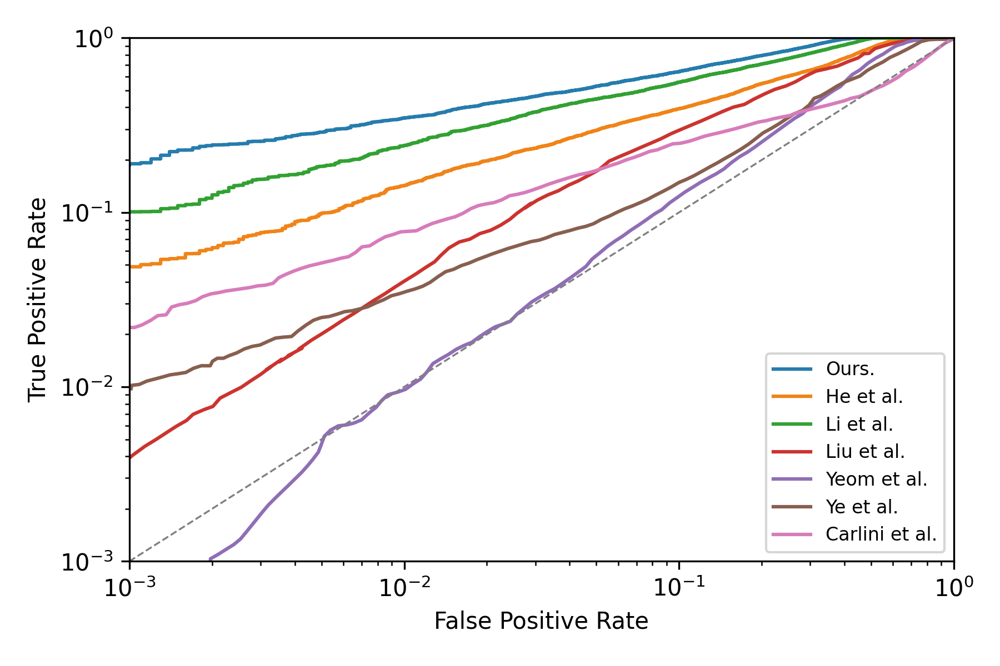

# LMTID
This official repository contains the source code and scripts for the paper "Leveraging Multiple Metrics to Improve Difficulty Calibration in Membership Inference Attacks " authored by Ning Zhou, Zetao Wang, Xiaoyan Liang, and Ruizhong Du.  
In this paper,We propose  LMTID(**L**everages **M**ultiple met-rics obtained during the model **T**raining to **I**mprove **D**ifficulty calibration), a novel framework for Membership Inference Attacks (MIAs). By incorporating knowledge distillation and constructing multi-metric sequences from different training stages, LMTID addresses the limitations of existing difficulty calibration approaches and significantly enhances the attack’s discriminative power.
# Environment dependencies
- pytorch 2.0.1
- CUDA 12.1
- python 3.9
# Directory structure
+ LMTID
  + data
    + cal_data
      - target_data.pt
      - shadow_data.pt
    + cifar-10-batches-py-official
    + CIFAR10
  + model_IncludingDistillation
    + CIFAR10
      - Shadow
      - Target
  + results 
  + attackMethodsFramework.py
  + LMTID.py
  + Metrics.py
  + MetricsSequence.py
  + Models.py
  + readData.py
+ README.md
# Supported Dataset and Model
_CIFAR10 CIFAR100 CINIC10 SVHN Location VGG16 MobileNetV2 ResNet50 DenseNet121_
# Usage instructions
We use VGG16 and CIFAR10 as examples to illustrate how to run_LMTID_ 
1. First, please download the CIFAR10 and put into `cifar-10-batches-py-official`.
2. Second, run He et al.'s method and get the calibrate membership score(save in `target_data.pt`and `shadow_data.pt`) .He et al .'s code can download on [Is Difficulty Calibration All We Need? Towards More Practical Membership Inference Attacks](https://github.com/T0hsakar1n/RAPID)
3. when you get the `target_data.pt`and `shadow_data.pt`,please put its in data/cal_data.
4. Once the above steps are completed,you can set the setting in `attackMethodsFramework.py` and run it to start the entire LMTID.
5. The ruselt while save in /result
6. After you get the ruselt you can use it to generate the ROC curve.part of LMTID result are put in /image,such as 
# Acknowledgements
Our code is built upon the official repositories of [Is Difficulty Calibration All We Need? Towards More Practical
 Membership Inference Attacks](https://github.com/T0hsakar1n/RAPID) (He et al., ACM CCS 24). We sincerely appreciate their valuable contributions to the community.
